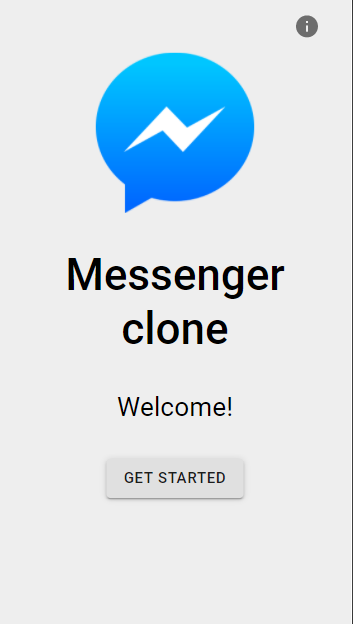
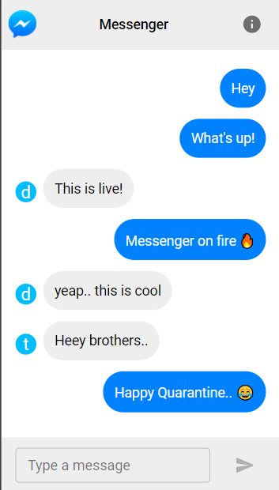

# Messenger clone with basic functionalities..

## How to use

- Fork and clone the project from GitHub.
- Setup your [firebase](https://firebase.google.com/) project and get the config key.
- Install the firebase command line tools to your PC by `npm i firebase -g`
- Run `npm install` for install the required dependencies for the project.
- If you already installed firebase in your PC, run `firebase init` in the command line inside the cloned directory.
- Create the `firebase.js` file in the src folder and paste the firebase config variables into the file.
- Import the `firebase.js` file into the `App.js` file.

_Check out the firebase documentations for more details._

 

## Available Scripts

In the project directory, you can run:

### `npm start`

Runs the app in the development mode.\
Open [http://localhost:3000](http://localhost:3000) to view it in the browser.

The page will reload if you make edits.\
You will also see any lint errors in the console.
